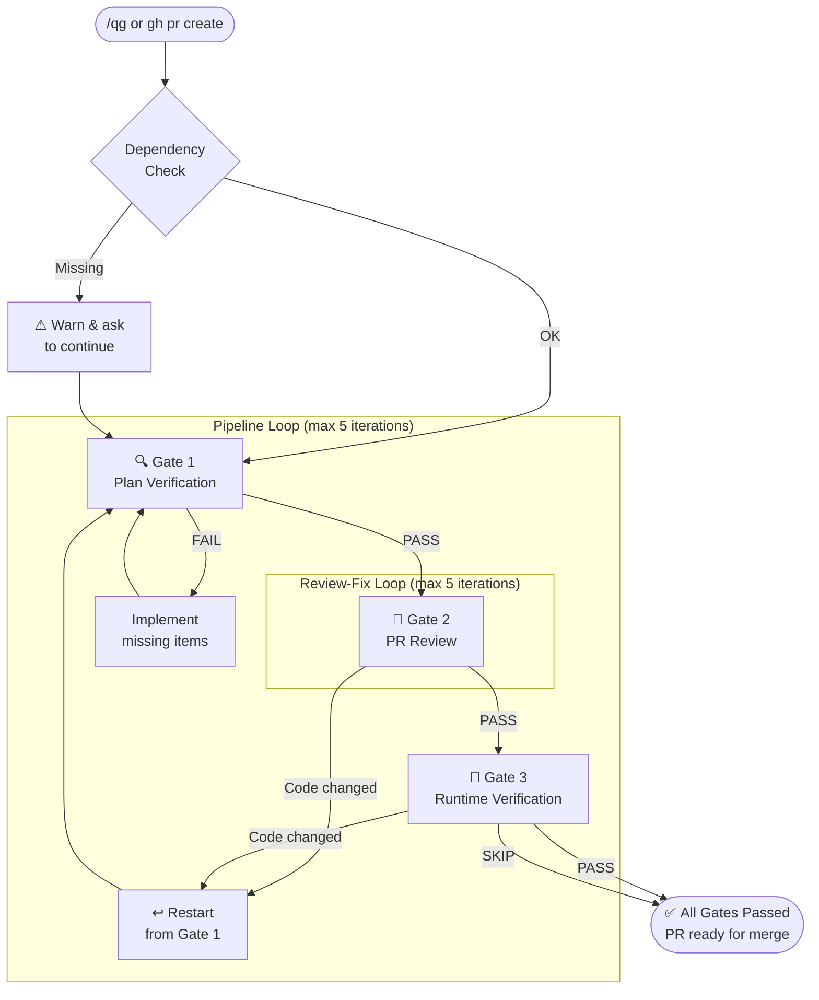
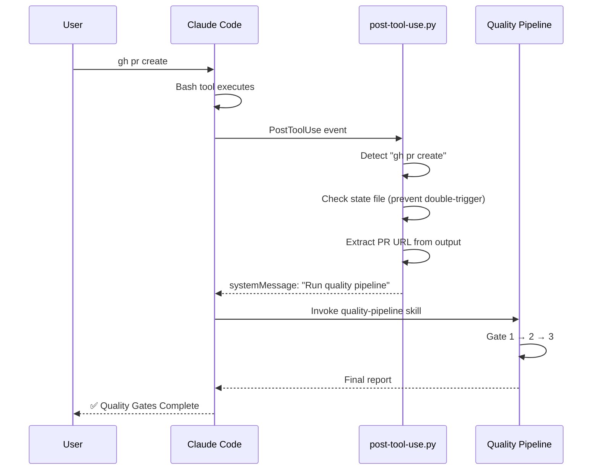

# Quality Gates Plugin

3-gate quality verification pipeline for Claude Code.

## Architecture

```
quality-gates/
├── .claude-plugin/         # Plugin metadata
│   ├── plugin.json
│   └── marketplace.json
├── agents/                 # Gate agents (dispatched by pipeline)
│   ├── plan-verifier.md    # Gate 1
│   ├── pr-reviewer.md      # Gate 2
│   └── runtime-verifier.md # Gate 3
├── commands/
│   └── qg.md               # /qg slash command
├── hooks/
│   ├── hooks.json           # Hook configuration
│   └── post-tool-use.py     # Auto-trigger on PR creation
└── skills/
    └── quality-pipeline/
        └── SKILL.md         # Pipeline orchestrator
```

## Gates

| Gate | Agent | Purpose |
|------|-------|---------|
| 1 | plan-verifier | Cross-references plan checkboxes with git diff |
| 2 | pr-reviewer | Orchestrates pr-review-toolkit agents iteratively |
| 3 | runtime-verifier | Starts the app, checks console errors, takes screenshots |

## Pipeline Flow

The pipeline runs gates sequentially. If code changes are made during review, it **loops back** to Gate 1 to re-verify — ensuring fixes don't break earlier checks.



## Auto-trigger Flow

When a PR is created via `gh pr create`, the hook automatically triggers the pipeline:



## Installation

### 1. Clone the plugin

```bash
git clone https://github.com/Jeongho-K/quality-gates ~/.claude/plugins/quality-gates
```

### 2. Register with Claude Code

```bash
claude plugin add ~/.claude/plugins/quality-gates
```

If `claude plugin add` is not available, manually add to `~/.claude/settings.json`:

```json
{
  "enabledPlugins": {
    "quality-gates@local-qg": true
  },
  "extraKnownMarketplaces": {
    "local-qg": {
      "source": {
        "source": "directory",
        "path": "~/.claude/plugins/quality-gates"
      }
    }
  }
}
```

> Replace `~` with your actual home directory path (e.g., `/home/username`).

### 3. Install required plugins

**pr-review-toolkit** (required for Gate 2 — iterative code review):

```bash
claude plugin add pr-review-toolkit
```

**Browser automation** (required for Gate 3 — runtime verification), install one of:

```bash
# Option A: Chrome DevTools MCP
claude plugin add chrome-devtools-mcp

# Option B: Playwright
claude plugin add playwright
```

## Prerequisites

- **pr-review-toolkit** plugin (required for Gate 2)
- **chrome-devtools-mcp** or **playwright** plugin (required for Gate 3)

## Usage

**Manual:** `/qg` or `/qg gate2` or `/qg --skip-runtime`

**Auto-trigger:** Creates PR with `gh pr create` -> hook injects pipeline automatically.

## Configuration

- `MAX_TOTAL_ITERATIONS`: 5 (full pipeline restarts)
- `MAX_GATE2_ITERATIONS`: 3 (review-fix cycles within Gate 2)

## State File

Pipeline state is tracked in `.claude/quality-gates.local.md` (auto-created, auto-deleted).
