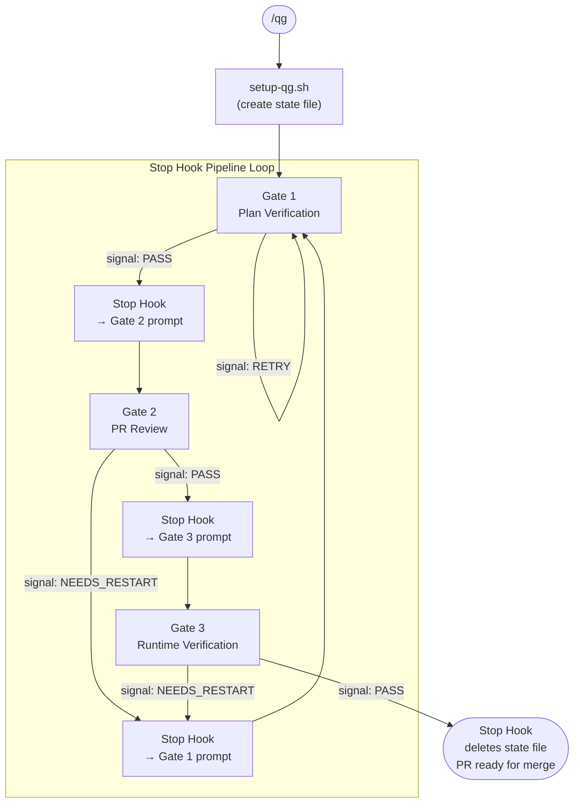

# Quality Gates Plugin

3-gate quality verification pipeline for Claude Code with multi-plugin review delegation.

## Architecture

```
quality-gates/
├── .claude-plugin/         # Plugin metadata
│   └── plugin.json
├── agents/                 # Gate agents (dispatched by pipeline)
│   ├── plan-verifier.md    # Gate 1
│   ├── pr-reviewer.md      # Gate 2
│   └── runtime-verifier.md # Gate 3
├── commands/
│   ├── qg.md               # /qg slash command
│   └── cancel-qg.md        # /cancel-qg command
├── hooks/
│   ├── hooks.json           # Hook configuration (Stop)
│   ├── post-tool-use.py     # (disabled; retained for rollback)
│   └── stop-hook.py         # Pipeline progression (state machine)
├── scripts/
│   └── setup-qg.sh          # Pipeline initialization
└── skills/
    └── quality-pipeline/
        ├── SKILL.md         # Single-gate executor
        └── references/
            ├── dependency-check.md   # Pre-flight dependency checks
            └── state-file-format.md  # Pipeline state file format
```

## Gates

| Gate | Agent | Purpose | Delegates To |
|------|-------|---------|-------------|
| 1 | plan-verifier | Cross-references plan checkboxes with git diff | feature-dev:code-explorer (impl trace), superpowers:verification-before-completion (evidence) |
| 2 | pr-reviewer | Orchestrates multi-plugin review agents iteratively | pr-review-toolkit (core review), feature-dev (conventions, architecture), superpowers (plan alignment) |
| 3 | runtime-verifier | Starts the app, checks console errors, takes screenshots | chrome-devtools-mcp or playwright |

## Gate 2 Review Phases

```
Phase 1 (Critical, always run, parallel):
  ├── pr-review-toolkit:code-reviewer        → bugs, security, logic
  ├── pr-review-toolkit:silent-failure-hunter → error handling
  └── feature-dev:code-reviewer              → conventions, guidelines

Phase 2 (Conditional):
  ├── pr-review-toolkit:type-design-analyzer  → new types
  ├── pr-review-toolkit:pr-test-analyzer      → test changes
  ├── pr-review-toolkit:comment-analyzer      → documentation
  ├── superpowers:code-reviewer               → plan alignment
  └── feature-dev:code-architect              → architecture

Phase 3 (Polish, non-blocking):
  └── pr-review-toolkit:code-simplifier       → simplification
```

## Pipeline Flow

The pipeline uses a **Stop hook** for automatic gate progression. Each gate runs as a
separate turn; the Stop hook reads the `<qg-signal>` tag emitted by the gate executor,
computes the next state, and injects the next gate's prompt.

```
/qg → setup-qg.sh → SKILL.md (Gate 1) → Stop hook → SKILL.md (Gate 2) → Stop hook → SKILL.md (Gate 3) → done
```

If code changes are made during review, it **loops back** to Gate 1 to re-verify.



## Usage

```
/qg                          # Full pipeline: Gate 1 → 2 → 3
/qg gate1                    # Plan verification only
/qg gate2                    # PR review only
/qg gate3                    # Runtime verification only
/qg --skip-runtime           # Gates 1 & 2 only
/qg --plan <path>            # Use specific plan file
/qg --pr-url <url>           # Specify PR URL
/cancel-qg                   # Cancel active pipeline
```

## Prerequisites

| Plugin | Required | Used By | Purpose |
|--------|----------|---------|---------|
| pr-review-toolkit | Yes | Gate 2 | Core review agents |
| feature-dev | No | Gate 1, 2 | Convention review, architecture, impl trace |
| superpowers | No | Gate 1, 2 | Plan alignment, evidence verification |
| chrome-devtools-mcp / playwright | No | Gate 3 | Browser automation |

## Configuration

- `MAX_TOTAL_ITERATIONS`: 5 (full pipeline restarts)
- `MAX_GATE2_ITERATIONS`: 5 (review-fix cycles within Gate 2)

## State File

Pipeline state is tracked in `.claude/quality-gates.local.md` (auto-created by setup script, auto-deleted by stop hook on completion).
